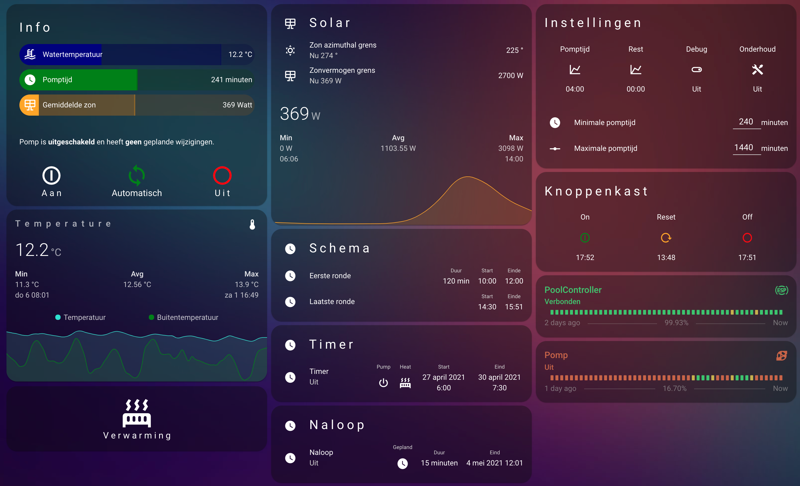

# HomeAssistant Pool automation

**English version below**

----

------

## Swimming pool equipment

 - 8 m3 swimming pool
 - (Dumb) sand filter pump (4 m3/h)
 - Smart Poolex heatpump (Tuya protocol)
 - Solar bol
 - Solar panel installation

Before I developed the automations in Home Assistant, I had already built a similar system using a Raspberry Pi Zero W running a webserver and a few scripts. However, this was not reliable enough to keep it running over weeks without maintenance, therefore I made the switch to Home Assistant (best thing I've ever started with!)

Let's extend a bit about the needs of the swimming pool. In order to keep the water in my pool fresh and clear, I have to pump the whole water volume two times a day, implying that I should run it at least two times, two hours a day (given my volume and flow rate of the pump). Since I'm most of the time heating my pool using the solar bol, I have to run my filter pump while the solar irradiance is high and therefore I've to choose some smart times for the filter cyclus. 

Since the sun irradiance can change over the day (at least in my country), I've made a smart automation for this. As a measure for the solar irradiance, the realtime electricity production of the solar panel system is used, one downside is that the solar bol and solar panels are facing the sun differently (solar bol receives high irradiation in the morning, while solar panels in the afternoon). In order to compensate a bit, an azimuthal angle threshold has been implemented. Further improvements have to be made.

## Functionalities
Before going in to the details of the automations, the functionalities have been implemented:
 - *AUTO (6)* | Option to run the filter pump **every day during a given time slot**
 - *AUTO (6)* | Option to calculate at a given time on a day the remaining time it should run in order to match its requirement (4 hours per day) and run the pump for the remaining time.
 - *MAN (5)* | Option to schedule the filter pump during an arbitrary **date and time range**, with or without heat pump enabled
 - *MAN (3)* | Option to run the filter pump as soon as the **heat pump** is running
 - *AUTO (7)* | Option to run the filter pump if the **solar irradiance** is above a given threshold
 - *MAN (1)* | Option to enable the filter pump when I'm **swimming** (so I can use the shower in the pool) either by
	 - pressing a pushbutton box on the side of the pool
	 - pressing a button on the Home Assistant frontend
	 - asking Siri (using the Home Assistant commands through Apple Shortcuts)
- *MAN (1)* | Option to set the filter pump on or off manually (ignoring automatic triggers) in case of **maintenance**
- *MAN (5)* |Option to schedule maintenance (using the same procedure as option 3)
- *AUTO (4)* | Option to let the pump run for some additional given minutes when done swimming or heating using the heat pump (in order to let the compressor release its heat)

Given all the options, you can already see that some of these options require an automatic operation mode where others require a manual operation mode (indicated in the list above by *AUTO* and *MAN*) in order to avoid that automatic triggers like higher solar irradiance or a schedule won't infer with my manually set status of the filter pump. 

In addition to that, some triggers/options have a higher precedence than others, therefore I assigned every trigger a priority level (indicated in the list as well). These priority levels are needed because you don't want the filter pump to switch off while you're swimming and the sun is behind the clouds for some minutes (giving a drop in solar irradiance) or the pump to switch on if you put off for maintenance (and you just disconnected some pipes).

## Measuring and switching equipment
Before I start explaining the automations and scripts, let's list the equipment at the pool:

 - NodeMCU (ESP8266)
 - Relay (230V - 10A)
 - DS18B20 Waterproof temperature sensor
 - Two pushbuttons placed in a Schneider XAL-D213 control station
 - (Home Assistant supervised running stable (!) on a Intel NUC)

The NodeMCU is flashed with ESPHome and the relay, temperature sensor and pushbuttons are connected to it, creating a really easy implementation with Home Assistant!

## Automations
As probably noted while reading the requirements, there are a lot of automations possible. All sharing the same behaviour:

> Whenever I get triggered, run a script which handles the trigger, switches the filter (and if needed, the heat) pump according to it and notify the user about a state change

Using an additional script to handle all the decision making, it is really easy to implement new features since all of the automations are only an adapter between the trigger and the decision maker (the script).
 
> Every caller of the script should send the `command` the script should execute and the name of the `trigger` in order for the script to decide if it is important enough.

Let's list the automations that run
 - Daily schedule
	 - Triggered when the current time is between the given time range (input_datetimes)
	 - Script parameters `command: on` and  `trigger: schedule`
- Solar
	- Triggered when the solar conditions (sensed by a binary_sensor) is changed, either by
		- the solar irradiance higher than the given threshold (input_number)
		- the solar irradiance below the given threshold (input_number)
		- the azimuthal angle exceeding the given threshold (input_number)
		- the sun being at 0 degrees azimuthal angle
	 - Script parameters `command: on` and  `trigger: solar`
- Timer (scheduled to be on/off over a given date and time period)
	 - Triggered when the current date and time is between the given date and time range (input_datetime) and the timer is active (i.e. planned or not)
	 - Script parameters `command: on/off` (depending on the given state during the timer) and  `trigger: schedule`

I'll update this later on!
