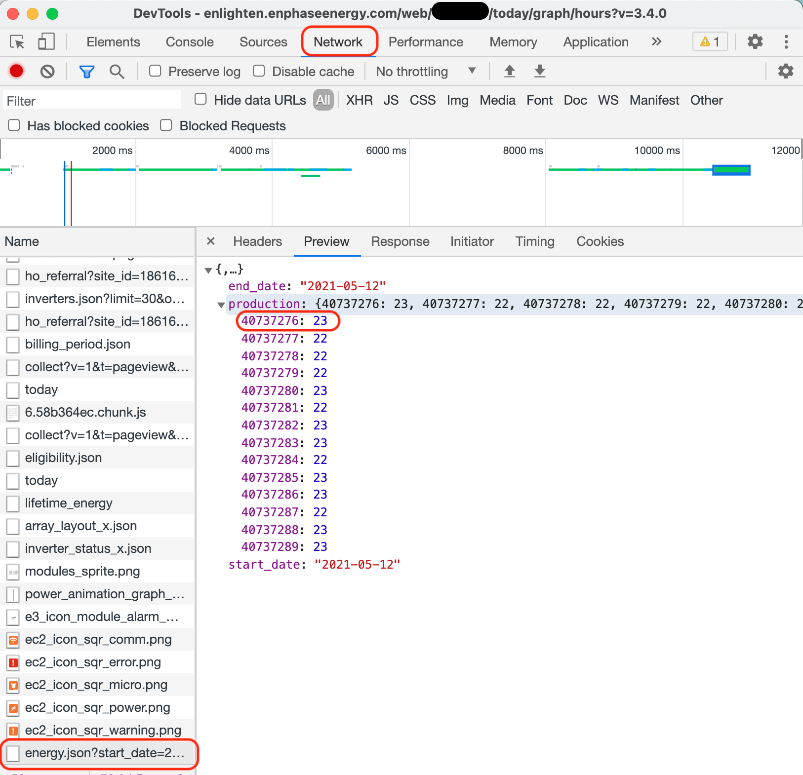
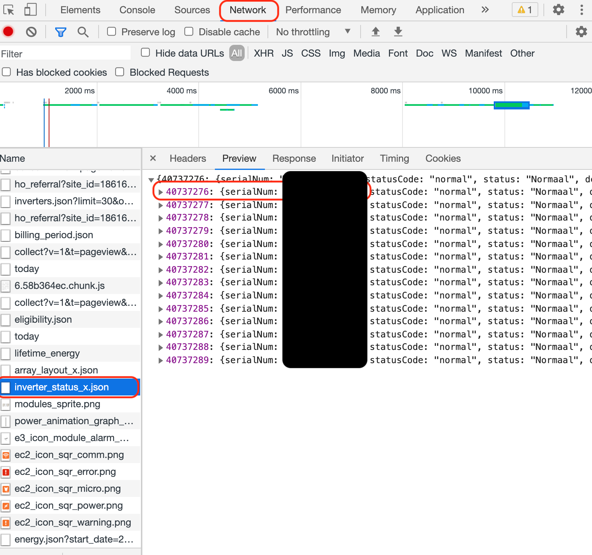

# Envoy Solar panel layout

A short guide to  find the serial-numbers of your micro-inverters in the array (in case the installer does not give you a installation sheet with stickers).

 1. Browse to https://enlighten.enphaseenergy.com/ and login (in Google Chrome or any other browser with developer tools)
 2. Check if the values on the solar panels are all distinct, if not, try again later (if more energy has been produced)
 3. Open the serie view
	  
 4. Open the developer tools (right-click > inspect)
 5. Click on the network tabblad in the upper menu
 6. Find the file called `energy.json` and open the preview in the right-hand panel.
 	  
 7. List all the purple numbers on a piece of paper or in a spreadsheet
 8. Per panel, check the current production and find that value in your array of step 1 and 2 (therefore, the values have to be distinct), write down the position of the panel on your piece of paper of spreadsheet
 9. Open now the file called `inverter_status_x.json` and match the numbers you've written down in step 7 with the serial numbers in the preview.
		

Now, you know the serial number of every micro-inverter. A pretty way to implement this in Home Assistant is by creating an image of your own solar panel array by copy pasting an arbitrary image of a solar panel and including this in a `picture-entity` card.

